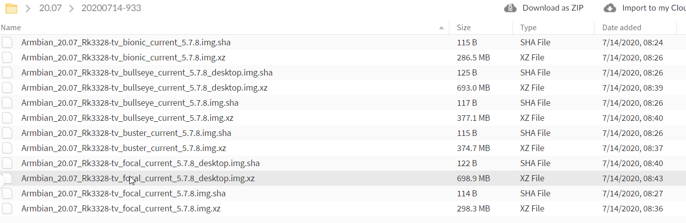

# Minecraft server on Leelbox Q4 (RK3328 SoC)


<p float="left" align="center">

<span style='font-size: 48pt;'>&nbsp;+&nbsp;</span>

<span style='font-size: 48pt;'>&nbsp;=&nbsp;✓</span>
</p>


This write-up documents the steps I took to get the [Minecraft server](https://www.minecraft.net/en-us/download/server) run on a cheap [Rockchip RK3328](http://opensource.rock-chips.com/wiki_RK3328) based [Android TV box](https://www.aliexpress.com/wholesale?SearchText=rk3328) (the procedure is non-destructive so you get to keep the original Android system).

Prior starting, I've anticipated lots of hiccups along the way. I didn't have much low-level experience with Android and I've heard enough scary words (U-BOOT, JTAG, UART, ...) to have serious doubts whether I have enough free time to perform the error and trial tinkering that was almost surely waiting around the corner. 

Most of my fears concentrated on whether the vendor took steps to prohibit booting from external media. 

It turned out my fears were completely unsubstantiated. Already the very first image of [LibreELEC](https://libreelec.tv/) I have [downloaded](http://releases.libreelec.tv/LibreELEC-RK3328.arm-9.2.6-box.img.gz) has booted successfully. That being said, I had to use the SD card + USB trick (the kernel booting from the SD card did not correctly recognize the MMC controller and hence did not find the root file system on the SD card, but adding an USB drive with the same Linux image has helped the kernel to find this second copy of the root file system).

Seeing that it it's possible to boot Linux from an external storage, I switched to a more full-fledged distribution, [armbian](https://www.armbian.com/). The rest of the journey is captured below.

All in all, it has been a fun exercise! 

My son loves sharing the server and his hosted world with his friends (keep your expectations low performance-wise, the hardware can barely keep up with several players, but is perfectly fine for 2). 

I hope my write-up is useful and that it may inspire some more dads to get their hands dirty and invite their sons to tinker together :-)


## About Leelbox Q4

In early 2018 I've noticed the market getting flooded by cheap Android TV boxes. I quickly [bought one](https://www.amazon.com/Android-Leelbox-Smart-Support-2-4GHz/dp/B07FNZJYYY/ref=cm_cr_arp_d_product_top?ie=UTF8), mainly due to the fact that our old Philips TV was not Android based yet. I was also curious and wanted to see what kind of experience these boxes deliver. Long story short, I think I only used it a handful of times :-)

I recently found the box in the drawer while doing some cleaning in my home-office. I thought to myself, what a shame, such a nice piece of hardware with no purpose to serve. And that is when the idea struck me.

There were several different models of the Leelbox Q4 floating around Amazon and AliExpress, namely Q4, Q4 S, Q4 Max, and Q4 Plus. The main difference seems to be in the amount of the internal storage (16, 32, and 64GB), and the version of Android (8.1 or 9.0).

The Leelbox is based on the [Rockchip RK3328 SoC](http://opensource.rock-chips.com/wiki_RK3328). The RK3328 SoC contains a quad-core ARM Cortex-A53 CPU (32KB L1 and 256kB L2 cache), 32KB internal SRAM, and a Mali-450MP4 GPU. This is for sure not the most performant ARM CPU out there, but it is not bad either. 

My particular model is called Q4 S, and it packs a 4GB of DDR3 RAM and a 32GB of eMMC storage. As far as connectivity goes, it offers 1xHDMI, 1xUSB 2.0, 1xUSB 3.0, 100M Ethernet, 2.4GHz WiFi, and BlueTooth 4.1.

<p float="left" align="center">
    
</p>


While searching for more information about the device on the [armbian forum](https://forum.armbian.com/), I've found out that there is another Android TV box that is virtually identical in hardware, called 'T9' (there are reports on the forum of people stripping their Leelboxes to find the T9 sticker on the board). Moreover, the H96Max+ is another highly similar piece of HW, differing slightly in the board, but similar enough to boot using the leelbox/T9 DTB file and vice-versa.

<p float="left" align="middle">

<span>&nbsp;&nbsp;&nbsp;&nbsp;&nbsp;&nbsp;&nbsp;&nbsp;&nbsp;&nbsp;&nbsp;&nbsp;</span>

</p>


## Prerequisites

Before starting, please make sure you have the following:

- Class A1 micro SDHC card (mine was a Sandisk Ultra 32GB) and a micro SD card reader,

- Balena Etcher or similar boot image flashing program,

- Latest armbian image for RK3288 (kindly provided by the armbian Forum user balbes150),

- DTB (Device Tree Blob file for your particular device instance),

- Local ETH network with a DHCP service,

- HDMI cable & USB keyboard are optional, but quite handy for debugging and initial setup.

  


## Install Armbian on the SD card

**1. Download armbian**

First of all, download the armbian image built for the RK3288-based TV box.  [Here](https://mega.nz/folder/zoZywCTQ#9sNfXIAB3m_DyLl5I8P94w/file/btpyQCzY) is the link to custom images maintained by the armbian Forum user [balbes150](https://forum.armbian.com/topic/8082-armbian-for-tv-box-rk3328/). 

I've downloaded the Ubuntu Focal Fossa flavor, highlighted in the image below.




**2. Obtain the correct Device Tree Blob (DTB) file**

This is the most tricky part. The Device Tree Blob is a special binary file database which the bootloader passes to the booting kernel in order to provide the kernel with the required low-level hardware information (basically to tell the kernel about the devices on the SoC). Without the correct DTB, the system will not boot, or will boot severely handicapped.

*A word of warning before you go on hunting for DTBs on the internet or [carving them out](https://github.com/PabloCastellano/extract-dtb) from your android OTA update images. The DTBs are kernel version dependent. Most of the RK3328-based Android devices are still running [Android with kernel 4.x.y](https://source.android.com/devices/architecture/kernel/android-common), whereas the armbian image above is using the mainline kernel (5.7.8). Trying to boot with 4.x.y DTBs will not work on this image.*

Based on a little bit of error and trial (definitely much less than I've anticipated), I've found that the  [rk3328-t9-mainline.dtb](files/rk3328-t9-mainline.dtb) works the best for my box.

| DTB                                                    | Target system                         | Source                                                       | Result of using on my box                                    |
| ------------------------------------------------------ | ------------------------------------- | ------------------------------------------------------------ | ------------------------------------------------------------ |
| [rk3328-box-h96mp.dtb](files/rk3328-box-h96mp.dtb)     | H96 Max+                              | [easyb](https://forum.armbian.com/topic/8082-armbian-for-tv-box-rk3328/?do=findComment&comment=94857) from armbian forum | System boots ok but several devices are missing, e.g. the CPU frequency control. |
| [rk3328-t9-mainline.dtb](files/rk3328-t9-mainline.dtb) | Leelbox Q4 (Q4 S, Q4 Max), Firefly T9 | [hexdump](https://forum.armbian.com/topic/8082-armbian-for-tv-box-rk3328/?do=findComment&comment=83807) from armbian forum | Boots and works perfectly! Maybe some devices, e.g. wifi and bluetooth, are not working (I did not check). |

*Your mileage may vary if your RK3328-based device is not identical to mine! I recommend searching through the armbian forum in [this thread](https://forum.armbian.com/topic/8082-armbian-for-tv-box-rk3328/), the kind folks there are really knowledgeable!*


**3. Flash the image to the SD card**

Insert the SD card into the PC and use Balena Etcher or a similar tool to flash the image to the card. 

<p float="left" align="center">
    
</p>

*Flashing may require the card to be formatted, in which case I recommend the 'official' [SD card formatter](https://www.sdcard.org/downloads/formatter/).*


**4. Configure the DTB**

Navigate to the SD card you just flashed, it should contain 2 partitions (if you are using Windows you will only see the first one called BOOT). Perform the following modifications:

1. Copy the chosen DTB file into the `/dtb/rockchip/` subfolder:

<p float="left" align="center">
    
</p>


2. Edit the `uEnv.txt` file to instruct the bootloader to pass this DTB file to the kernel.

   ```bash
   LINUX=/zImage
   INITRD=/uInitrd
   
   FDT=/dtb/rockchip/rk3328-t9-mainline.dtb ### EDIT THIS LINE TO REFLECT YOUR DTB
   APPEND=root=LABEL=ROOTFS rootflags=data=writeback rw console=uart8250,mmio32,0xff130000 console=tty0 no_console_suspend consoleblank=0 fsck.fix=yes fsck.repair=yes net.ifnames=0
   ```

   Make sure that the FDT line points to the correct DTB file! 
   
   *By the way, the file is using Unix line ending (\n), in case your editor is confused. On Windows I recommend Notepad++.*


**5. Boot**

Safely remove the SD card from your PC (unmount, eject, etc.) and put it into the SD card slot of your box, which should be waiting powered off. 

If all goes well, your box should boot from the SD card immediately once given power! After I saw the ETH light on the switch turning on,  I went to the web interface of our home router to check the DHCP server log to find out the IP of the box. You can also use a scanner such [Angry IP Scanner](https://angryip.org/) or [NMAP](https://nmap.org/) to find the box.

*Things to consider in case the box is not booting:*

- Is the SD card properly inserted
- Try another SD card
- Try another DTB file, experiment!
- It may be necessary to connect a keyboard and a TV or monitor for debugging.

In any case, even if your box is not booting, you can simply remove the SD card and you will have your original Android system back.


**6. Initial configuration**

When you log in for the first time using ssh (using the default root password of 1234), you will be greeted by a screen similar to the one below (in the captured screenshot the Minecraft server is already running as can be seen by the 80% memory usage).

<p float="left" align="center">
    
</p>

You are mostly on your own regarding configuration of your box. There are thousands of things that can be tweaked, and each user has their own preferences. Nevertheless, I would strongly propose to at least do the following:

- **Change the root password** and simply follow the initial armbian configuration [instructions](https://docs.iqrf.org/images/ssh-setting.png) (when asked to create a new user, I have created a user called minecraft).

- **Update all packages**

  ```
  apt-get update && apt-get dist-upgrade
  ```

- **Prevent random changing of the ETH MAC address**. 

  I noticed that the box gets a different MAC address every time it boots. This is most probably a bug in the armbian image or the kernel. 

  My workaround was to override the MAC address with a fixed one, which can be done by editing the `/etc/network/interfaces` file. Find the eth0 section and add a `hwaddress` stanza below the `iface eth0 inet dhcp` one (observe the indentation!).

  ```bash
  # Wired adapter #1                   
  allow-hotplug eth0                   
  no-auto-down eth0                    
  iface eth0 inet dhcp                 
      hwaddress ether 5a:2f:f6:e8:bd:2c  # leave as is or use a random MAC
  ```

  I also configured the router to reserve an IP for this MAC address to get a fixed address, e.g. 192.168.1.211 in my case.

  Having done that, I noticed that somehow the DHCP settings provided by my router were not completely adopted by the system. Specifically, the DNS part was missing! Obviously, there is something broken in the way the NetworkManager operates on this particular armbian image, and I was not inclined to investigate. *Besides, I have yet to see NetworkManager behaving in a sensible way...*

  So, my workaround was simply to prevent NetworkManager from touching `/etc/resolv.conf`by putting the `dns=none` into the `[main]` section of the `/etc/NetworkManager/NetworkManager.conf` file.

  ```bash
  [main]                       
  dns=none                     
  rc-manager=file              
  plugins=ifupdown,keyfile     
                               
  [ifupdown]                   
  managed=true                 
                               
  [device]                     
  wifi.scan-rand-mac-address=no
  ```

  I *could* have gone one step further and completely disabled the NetworkManager, but I did not want to spend the time resolving potential side-effects.

- **Stop booting into the GUI**

  As the box will only be used over the network, as well as for the sake of conserving the limited resources of the box, it makes no sense to boot into the Desktop environment. The easiest way is to use the `armbian-config` ncurses-based configuration tool, as it is just a few steps in the menu.

  ```
  armbian-config # navigate as follows: System -> Desktop -> Disable desktop
  ```

  

## Install Java

I tried several Java implementations to see which one has the highest performance on this piece of hardware.

I ran the [DaCapo](http://dacapobench.org/) benchmarks on Oracle JDK 1.8.0_271, OpenJDK 14.0.2, and Oracle JDK 15.0.1. Based on repeating each benchmark 5 times, the *Oracle JDK 1.8.0_271* version performs the fastest (with the exception of the sunflow test).

<p float="left" align="center">
    
</p>

My choice was (later) also corroborated by observing the CPU usage while running the Minecraft server with different implementations. Using Oracle JDK 1.8.0_271 resulted in the lowest CPU utilization.

Anyhow, to install Oracle JDK 1.8.0_271, you can download `jdk-8u271-linux-aarch64.tar.gz` [from the Oracle page](https://www.oracle.com/java/technologies/javase/javase-jdk8-downloads.html). You will need to have an Oracle account to get the download link. I also heard about the 'otn → otn-pub' trick, which I will not elaborate here and you can probably also easily find it via Google ;-).

I installed java in the `/opt/jdk-1.8.0_271/` folder.

```
root@rk3328-tv:~# /opt/jdk-1.8.0_271/bin/java -version
java version "1.8.0_271"
Java(TM) SE Runtime Environment (build 1.8.0_271-b09)
Java HotSpot(TM) 64-Bit Server VM (build 25.271-b09, mixed mode)
```

*Alternatively, you can install OpenJDK runtime via apt-get.*

```
apt-get install openjdk-14-jre openjdk-14-jre-headless
```

*You can also choose other version of OpenJDK, 8, 11, 13, & 14 are available via the enabled APT repos.*


## Install & run Minecraft server

Obtaining and installing the Minecraft server is relatively easy. The java version of the server can be downloaded [here from the official page](https://www.minecraft.net/en-us/download/server). As of writing this document, the latest release was 1.16.4.

I quickly found out that using the official version consumes lots of resources, especially on the CPU side while the world chunks are being generated. Also during casual play I've noticed frequent messages of 

```
[16:00:04 WARN]: Can't keep up! Is the server overloaded? Running 5002ms or 100 ticks behind
```

I've Googled and learned that this message is often received when the server is overloaded.  Which is a bummer, as I only connected with a single client.

I then went on to search for a higher performing version. Of course, there is not just one available, but there are a [multitude of community forks](https://www.spigotmc.org/wiki/what-is-spigot-craftbukkit-bukkit-vanilla-forg/) that are at least equivalent to or offer even more features compared to the official version. 

In the end I've settled on [PaperMC](https://papermc.io/), which describes itself as the *'... the next generation of Minecraft server, compatible with Spigot plugins and offering uncompromising performance'.* The main benefit of PaperMC is that it tries to include multi-threading wherever the official server is single-threaded. Given that the box has 4 CPU cores, and each core is quite slow, I've figured that this should result in a measurable performance boost, and it did!

I've logged in as the 'minecraft' user and created a `server` folder in the home folder of this user. I then downloaded paper jar file into the server folder, and made a symbolic link to `paper.jar` for easier version switching.

```
ln -sf paper-1.16.4-362.jar paper.jar
```

Next, I've Googled to se which Java flags to use to get the most out of it. I've found [this nice page](https://aikar.co/2018/07/02/tuning-the-jvm-g1gc-garbage-collector-flags-for-minecraft/) documenting the flags which are recommended and battle-tested by the enthusiasts. As my box has 4 GB of memory, I've reserved 3GB for Minecraft via `-Xms3G -Xmx3G` flags. Obviously, if your box has less or more memory, you will need to modify those flags accordingly (always leave at least 100-200MB free for the OS).

Lastly, I run Minecraft via screen so it doesn't exit when I logout, and I can easily reattach to it afterwards. The content of my `minecraft.sh` script, also located in the `server` folder, is shown below.

```bash
#!/bin/sh

java=/opt/jdk-1.8.0_271/bin/java

screen -dm -S Minecraft $java -Xms3G -Xmx3G -XX:+UseG1GC -XX:+ParallelRefProcEnabled -XX:MaxGCPauseMillis=200 -XX:+UnlockExperimentalVMOptions -XX:+DisableExplicitGC -XX:+AlwaysPreTouch -XX:G1NewSizePercent=30 -XX:G1MaxNewSizePercent=40 -XX:G1HeapRegionSize=8M -XX:G1ReservePercent=20 -XX:G1HeapWastePercent=5 -XX:G1MixedGCCountTarget=4 -XX:InitiatingHeapOccupancyPercent=15 -XX:G1MixedGCLiveThresholdPercent=90 -XX:G1RSetUpdatingPauseTimePercent=5 -XX:SurvivorRatio=32 -XX:+PerfDisableSharedMem -XX:MaxTenuringThreshold=1 -Dusing.aikars.flags=https://mcflags.emc.gs -Daikars.new.flags=true -jar paper.jar nogui

screen -ls Minecraft
echo "If you want to attach to the above screen session, type 'screen -R Minecraft'"
```


*Happy crafting!*
